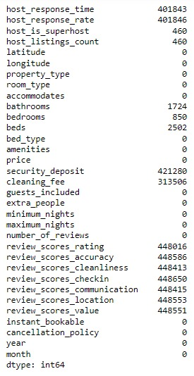
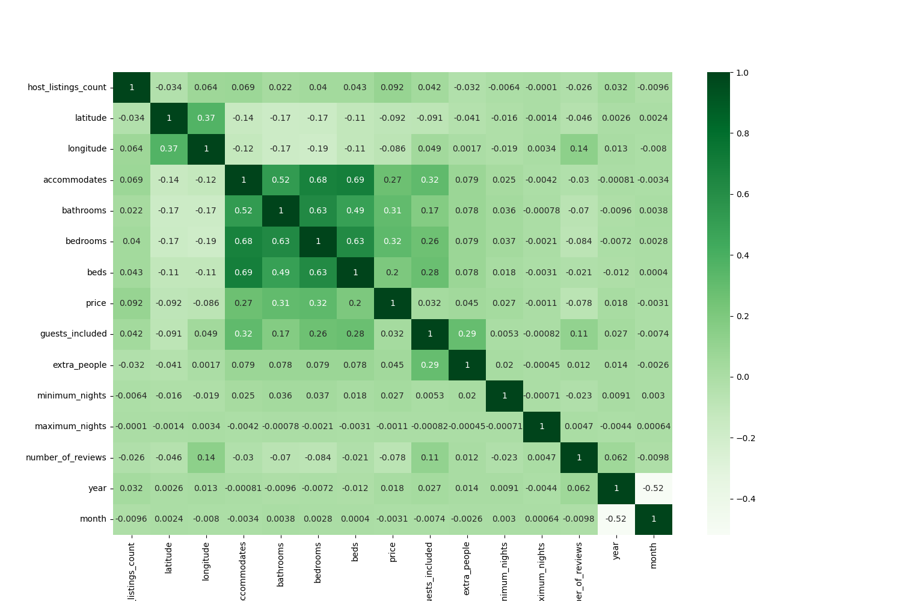
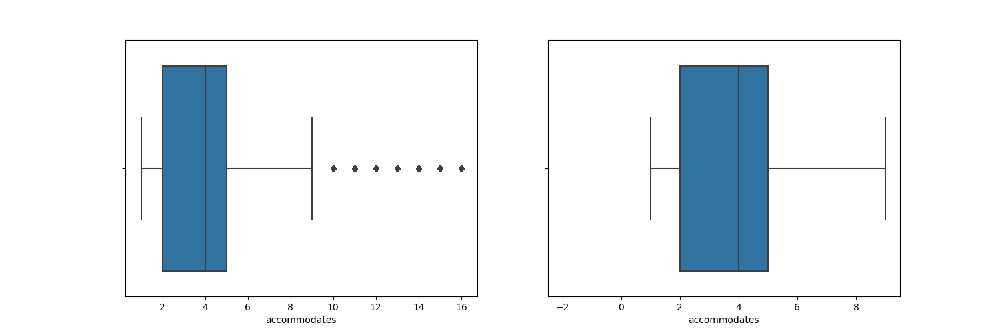
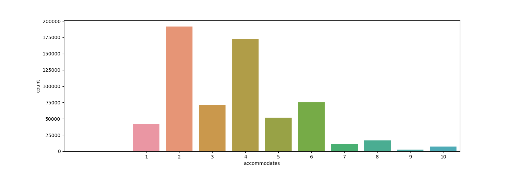
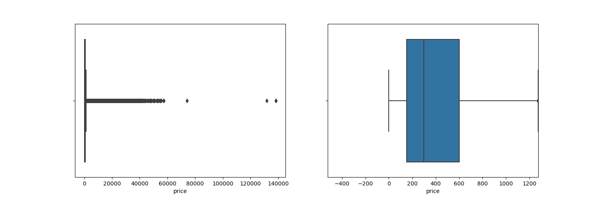
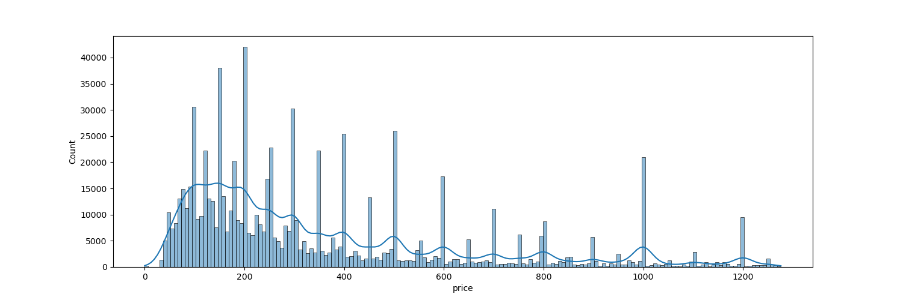
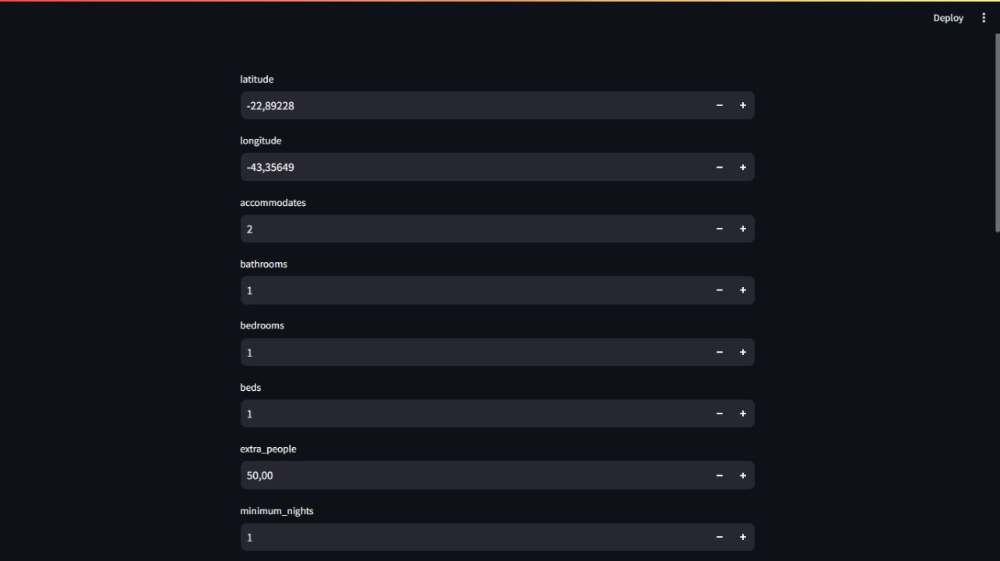
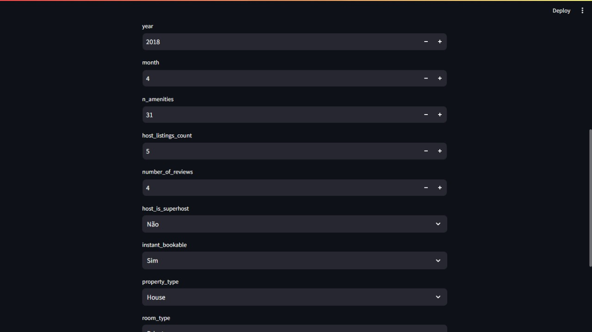
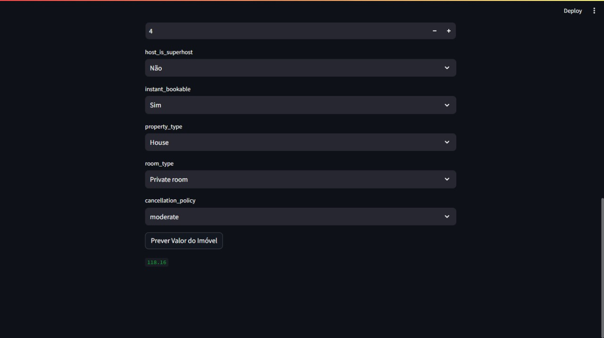

# Título do Projeto 🚀

## índice 🏹
  - <a href="#contextualização-do-projeto-airbnb">Contextualização do Projeto Airbnb</a>
  - <a href="#dados-utilizados">Dados Utilizados</a>
  - <a href="#tecnologias-utilizadas">Tecnologias Utilizadas</a>
  - <a href="#bibliotecas-utilizadas">Bibliotecas Utilizadas</a>
  - <a href="#explicação-do-andamento-do-projeto">Explicação do Projeto</a>
  - <a href="#análise-explanatória-e-tratamento-dos-outliers">Análise Explanatória e Tratamento dos Outliers</a>
  - <a href="#explicação-das-ias">Explicação das IAs</a>
  - <a href="#deploy">Deploy</a>
  - <a href="#aprendizados">Aprendizados</a>
  - <a href="#olá-eu-sou-o-lucas-👋">Sobre Mim</a>

## Contextualização do Projeto Airbnb
O objetivo deste projeto é determinar o preço de diária de imóveis com base em suas características específicas. O projeto visa ajudar pessoas do Rio de Janeiro e não tem foco em impresas imobiliárias, mas sim em pessoas normais que ou querem disponibilizar um imóvel no Airbnb ou pessoas que querem alugar um imóvel por alguns dias e querem verificar se o valor cobrado está dentro do normal. Este projeto visa facilitar a vida de pessoas que desejam alugar ou disponibilizar imóveis de maneira rápida e eficiente, proporcionando uma avaliação precisa dos valores de diárias.


## Dados Utilizados
Para baixar a base de dados, acesse o link https://www.kaggle.com/datasets/allanbruno/airbnb-rio-de-janeiro. Clique no ícone de download e, em seguida, organize todos os arquivos '.csv' na pasta denominada 'dataset'. A base de dados disponibilizada será fundamental para treinar a Inteligência Artificial, permitindo que ela aprenda padrões e realize análises relacionadas aos preços de diárias de imóveis. Essa base de dados consolidada tem mais de 100 colunas, então não será possível explicar cada coluna da base, porém mais para frente da documentação do projeto irei detalhar como analisei e exclui as colunas que não ajudariam o nosso modelo de IA.

## Tecnologias Utilizadas

Escolhi Python como linguagem principal para meu código em Ciência de Dados devido à sua versatilidade e eficácia no ecossistema dessa área. A vasta gama de bibliotecas especializadas, como NumPy, Pandas e Scikit-Learn, oferece ferramentas poderosas para manipulação de dados, análise estatística e implementação de modelos preditivos, simplificando significativamente o desenvolvimento e a execução de tarefas complexas.

Além disso, a comunidade ativa e o suporte robusto em Python proporcionam recursos valiosos, facilitando a resolução de problemas e a implementação de soluções inovadoras. A sintaxe clara e legível de Python contribui para um código mais compreensível, promovendo a colaboração e a manutenção eficiente do projeto em Ciência de Dados.

## Bibliotecas utilizadas
Instale as bibliotecas utilizadas no projeto, como o projeto é extenso existem várias bibliotecas para serem instaladas, algumas bibliotecas utilizadas no projeto já vem instaladas no python por padrão, destas usaremos a datetime e a pathlib. Para realizar as instalações abra o cmd e digite:

```bash
  pip install pandas
```
```bash
  pip install numpy
```
```bash
  pip install matplotlib
```
```bash
  pip install seaborn
```
```bash
  pip install scikit-learn
```
```bash
  pip install joblib
```
```bash
  pip install streamlit
```


# Explicação do andamento do  projeto
Como a base de dados tinha mais de 100 colunas precisei analisar coluna por coluna para entender se aquela coluna iria trazer uma informação importante ou não para o modelo, já que para uma IA muita informação pode acabar prejudicando seu desempenho, visto que com muita informação ela pode acabar ficando muito lenta para conseguir dar um resultado ou até mesmo tenha sua eficacia prejuidaca pelo escesso de informação. Tendo em vista esse fator decidi excluir os seguites grupos de colunas:

1- ID, Links e colunas que não possuem uma informação relevante para o modelo

 2- Colunas com as mesmas informações ou com informações parecidas. EX: Data x Ano/Mês

 3- Colunas com texto livre, pois não faremos uma análise de palavras ou algo parecido

 4- Colunas que possuem todos ou quase todos os valores com mesmo valor/vazios

Depois dessa exclusão a nossa base de dados foi de mais de 100 colunas para 33 colunas, um número muito menor e com apenas informações que poderiam ser utéis para o modelo, agora é o momento de analisar se nos nossos dados existiam valores nulos, pois os modelos de inteligência arficial não conseguem trabalhar com valores nulos então tinha que indentificar esses valores e ver como poderiamos tratrá-los.
E na nossa base de dados existiam muitos valores nulos, várias estavam com valores nulos como pode ser visto na imagem abaixo:



Então tomei as seguintes decisões para os valores nulos na base de dados:

1- como temos muitos valores nulos em algumas colunas, compensa excluir essas colunas, pois caso preenchecemos com algum tipo de parâmetro poderiamos prejudicar o nosso modelo

2- para as outras colunas que temos poucos NaN vamos excluir a linha inteira, pois temos mais de 900 mil linhas, e essa pequena quantidade que será excluída não afetara nosso modelo

Depois com a nossa base de dados tratada comecei a fazer a análise explanatória dos dados e entender o que eu faria com os outliers das colunas
## Análise Explanatória e Tratamento dos Outliers
Comecei analisando a correlação de cada coluna, para ter um melhor entendimento das informações e entender o que fazer depois disso. 


Com a análise desse gráfico consegui ter uma noção geral de como cada coluna poderia influenciar no preco do imóvel, por mais que a IA teria que conseguir descrever isso é muito importante ter uma noção pois a IA poderia acabar tendo algum erro que eu não fosse perceber caso não tivesse uma noção básica do projeto.

Depois disso comecei a fazer as análises dos outliers de cada coluna dos dados da seguinte forma:

1. Excluir outliers (usaremos como regra, valores abaixo de Q1 - 1.5 * Amplitude e valores acima de Q3 + 1.5 * Amplitude). Amplitude = Q3 - Q1

2. Confirmar se todas as features que temos fazem realmente sentido para o nosso modelo ou se alguma delas não vai nos ajudar e se devemos excluir

Para cada coluna gerei os seguintes gráficos (vou usar duas colunas como exemplo, mas o raciocinio foi o mesmo para todas as colunas):


Com esse gráfico entendia como estavam dispersos os valores dentro da base de dados e sempre que os outliers iriam prejudicar o nosso modelo eu excluia para sempre deixar a base de dados o melhor possível para a nossa IA.



Depois eu analisava como os nossos dados ficaram na nossa base de dados depois da exclusão dos outliers, importante lembrar que nem todos os outliers foram excluidos, apenas aqueles que poderiam prejudicar a nossa IA.




Para a nossa coluna de 'Preço' tive o mesmo cuidado para entender o que os outliers diziam e qual era o objetivo final do nosso modelo. Repeti esse processo para todas as colunas da nossa tabela e depois cheguei no processo de encoding.

Para as colunas que possuiam um texto precisei ajustar as features para facilitar o trabalho do modelo futuro (features de categoria, true e false, etc.)

- Features de Valores True ou False, vamos substituir True por 1 e False por 0.
- Features de Categoria (features em que os valores da coluna são textos) vamos utilizar o método de encoding de variáveis dummies

Variáveis dummies, também conhecidas como variáveis indicadoras ou variáveis binárias, são utilizadas para representar categorias em uma forma numérica no contexto da análise de dados. 


## Explicação das IAs
No decorrer do projeto, testamos três modelos de inteligência artificial, adotando essa abordagem para assegurar que, caso uma das IAs não atendesse nossos requisitos, teríamos alternativas disponíveis. Utilizamos os seguintes parâmetros para avaliar a eficácia das IAs:

R² (Coeficiente de Determinação): Quanto mais próximo de 100%, melhor a assertividade da IA. Por exemplo, uma IA com R² de 60% é considerada inferior a uma com R² de 80%.

Erro Quadrático Médio (RMSE): Uma métrica que avalia a precisão do modelo de regressão. Um RMSE menor indica uma melhor capacidade do modelo em ajustar-se aos dados observados.

Tempo de Resposta: Em casos de semelhança entre R² e RMSE, o tempo de resposta é utilizado como critério de desempate.

 Os modelos utilizados nesse projeto foram o ExtraTrees, RandomForest e o LinearRegression, abaixo teremos uma tabela com os resultados dos parâmetros utilizados    
| IA   | R²       | RSME      |  Tempo      |  
| :---------- | :--------- | :--------- | :--------- |
| ExtraTrees | 97.03% | 47.33 | 24 segundos
| RandomForest  | 96.75% | 49.51 | 6 segundos
| LinearRegression  | 34.95% | 221.52 | 0.248637 segundos

Percebemos que o modelo LinearRegression teve um tempo de resposta menor do que 1 segundo, mas sua acertividade (R²) de 34.95% é muito baixo e seu RSME de 221.52 é extremamente alto, então optei por não usar esse modelo. Os modelos ExtraTrees e RandomForest foram muito parecidos tanto no R² visto que são 97,03% e 96,75% respectivamente, quanto no RSME 47,33 e 49,51 e com uma diferença bem baixa em questão do tempo, por conta desses valores analisados optei por usar o ExtraTrees como modelo de previsão.
## Deploy
Durante o deploy da IA, optei por incorporar a biblioteca 'streamlit' para desenvolver um micro-site. Essa escolha foi motivada pela praticidade de criar uma interface intuitiva contendo todas as informações necessárias para a previsão da diária. Além disso, a utilização do micro-site oferece uma abordagem mais organizada, simplificando o acesso às funcionalidades da IA sem exigir conhecimentos avançados em programação. 

Imagens para mostrar como ficou o resultado final:




## Aprendizados
A criação deste modelo de inteligência artificial foi uma experiência extremamente gratificante e divertida. Ao aplicar meus conhecimentos em Python e explorar diversas bibliotecas, pude enfrentar desafios significativos, sendo a análise exploratória de dados um dos momentos mais complexos. Esse processo demandou tempo, atenção e paciência, pois compreendi a importância desses dados para o treinamento das IAs. Mesmo diante das dificuldades, não desisti. Este é meu primeiro projeto, e sinto uma grande evolução. Estou ansioso para os próximos desafios que enfrentarei e para continuar aprendendo.

# Olá, eu sou o Lucas! 👋
Aos 19 anos, trilho meu caminho na Ciência de Dados com paixão pela programação. Com habilidades avançadas em Python e conhecimento intermediário em SQL, enfrento desafios com entusiasmo, especialmente na criação de inteligência artificial. Embora meu inglês seja inicial, estou dedicado aos estudos para aprimorá-lo. Estou aqui para aprender, crescer e deixar minha marca na interseção entre dados e inovação.

## Links para me contatar 🔗 
[](https://github.com/LucasSantos875478)
[](https://www.linkedin.com/in/lucas-santos-454584285/)
[](https://www.instagram.com/lucassantos875478/)
